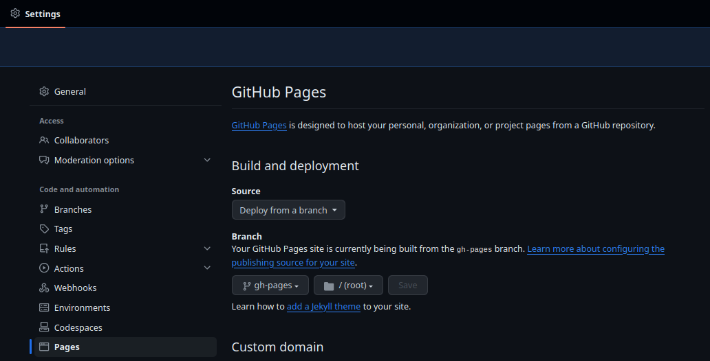

# Recetas cuarentena

Esta página web contiene un listado de recetas de cocina sencillas pensadas para una persona.

[Visualizar web con las recetas](https://lmontes.github.io/recetas-cuarentena).

## Desarrollo

Crear entorno e instalar librerías

```bash
python -m venv .venv
source .venv/bin/activate
pip install -r requirements.txt 
```

Mostrar documentación en el navegador web

```bash
mkdocs serve
```

Ir a http://127.0.0.1:8000 para ver la documentación.

## Configuración del repo

Para que se genere la web es necesario que el repositorio tenga la siguiente configuración.



## Tecnologías empleadas

* [Mkdocs](https://www.mkdocs.org)
* [Material for MkDocs](https://squidfunk.github.io/mkdocs-material)
* [FontAwesome icons](https://fontawesome.com): se han empleado los siguientes iconos:
  * [book](https://fontawesome.com/icons/book): como logotipo de la web.
  * [kitchen-set](https://fontawesome.com/icons/kitchen-set): para recuadros de utensilios necesarios.
  * [list](https://fontawesome.com/icons/list): para recuadros de ingredientes.
