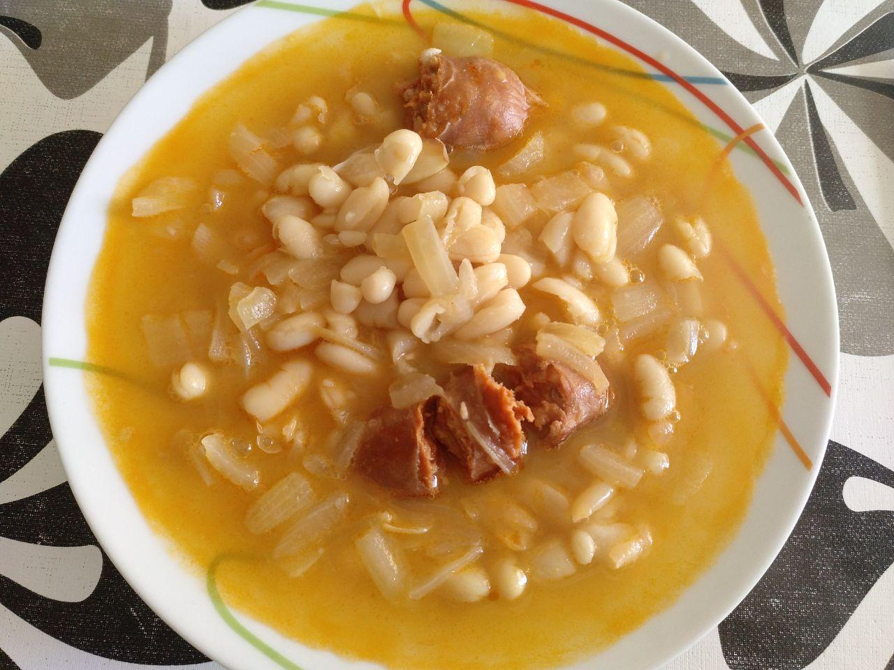

# Alubias con chorizo

!!!ingredients "Ingredientes para una persona"

    * [Bote de alubias blancas cocidas](../ingredientes/alubias-blancas-cocidas.md) pequeño
    * [Caldo de carne](../ingredientes/caldo-carne.md)
    * Media cebolla
    * Un chorizo

!!!utensils "Utensilios necesarios"

    * Cazuela
    * Sartén

## Elaboración

1. Sofreímos el chorizo en una sartén.
1. Cortamos media cebolla, la troceamos y ponemos a sofreír.
1. Ponemos el caldo de carne a hervir en una cazuela, aproximadamente 1/2 litro.
1. Cuando el caldo hierva, echamos el chorizo, la cebolla y medio bote de alubias a la cazuela.
1. Lo dejamos hervir a fuego lento durante 20 minutos.
