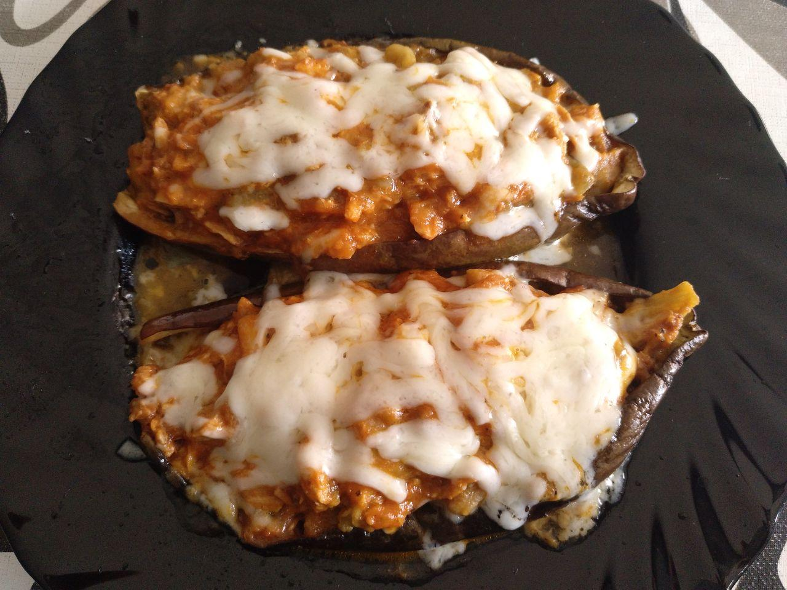
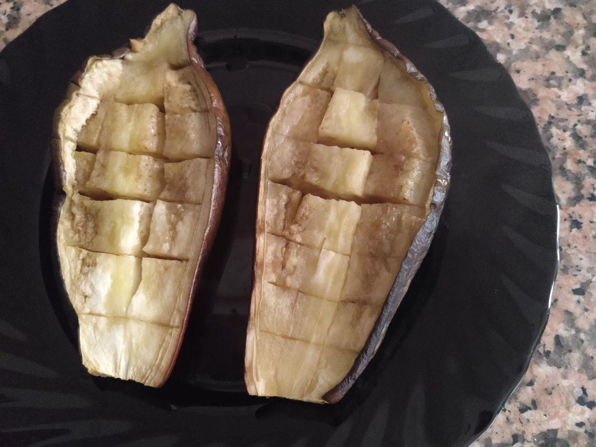
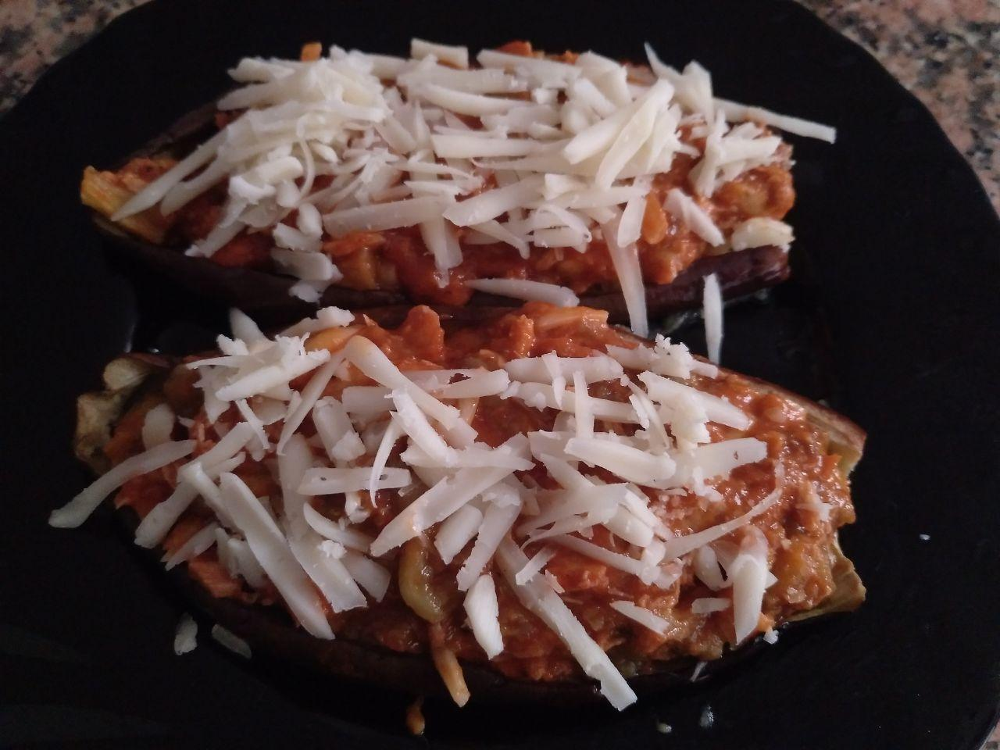

# Berenjenas rellenas

!!!ingredients "Ingredientes para una persona"

    * [Lata de atún](../ingredientes/atun.md)
    * Una berenjena
    * Tomate frito
    * Queso rallado
    * Aceite de oliva
    * Sal

!!!utensils "Utensilios necesarios"

    * Bol para hacer la mezcla

## Elaboración

1. Cortamos la berenjena por la mitad, cortamos las mitades en cuadrícula pero sin romper la piel.
1. Echamos aceite de oliva y sal por encima de las dos mitades
1. Metemos la berenjena en el microondas 15 minutos a máxima potencia. Al sacarla veremos algo similar a lo mostrado en la siguiente imagen.
  
1. Con ayuda de una cuchara y un tenedor extraemos la pulpa de la berenjena sin romper la piel y la echamos a otro recipiente.
1. Mezclamos la pulpa de la berenjena con un poco de tomate frito y una lata de atún, podemos echarle también un poco de queso rallado.
1. Colocamos la mezcla resultante sobre la piel de la berenjena y echamos queso rallado por encima. Quedará algo similar a lo que se puede ver en la siguiente imagen.
  
1. Calentamos la berenjena 3 minutos en el microondas.
