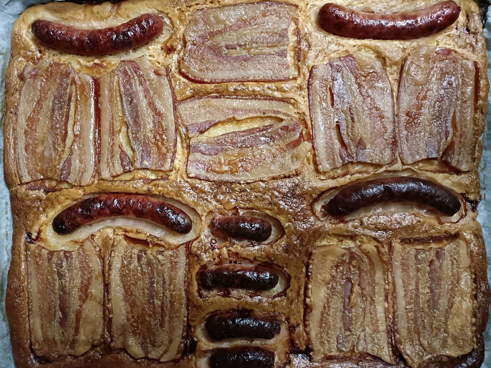
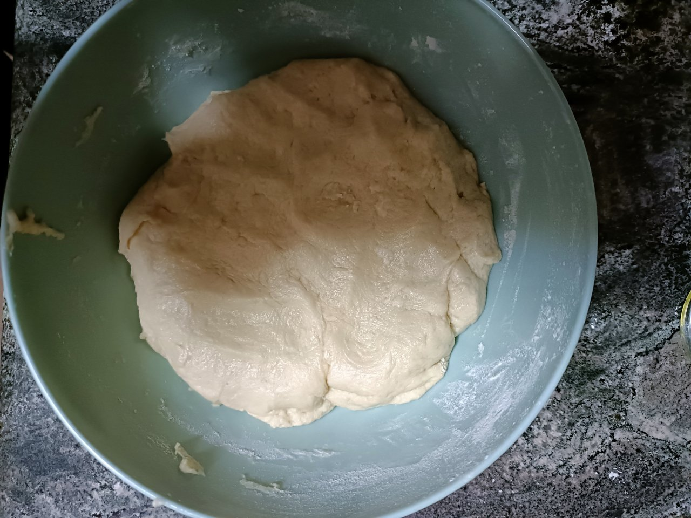
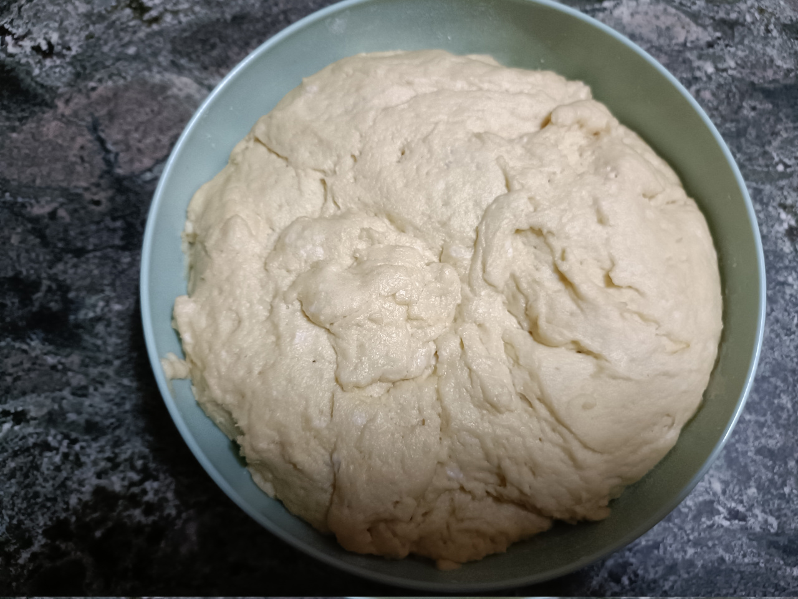
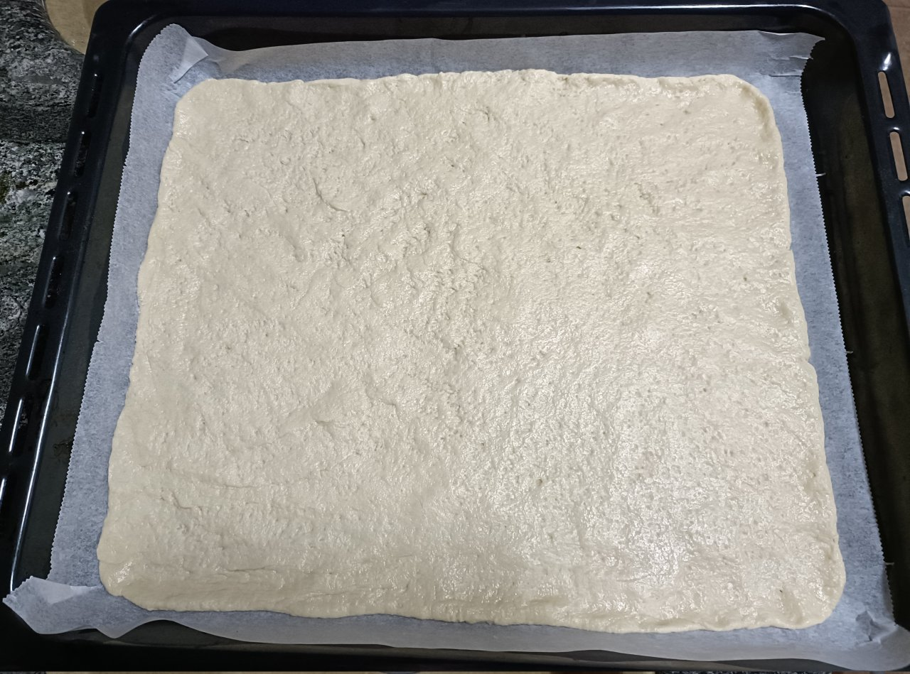
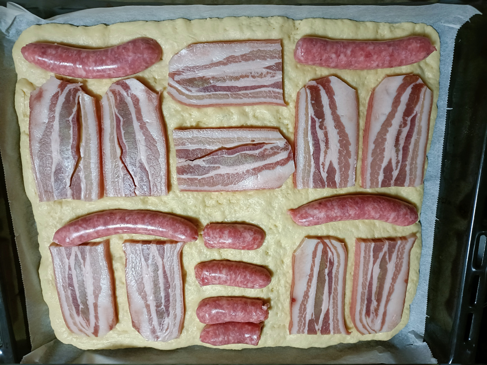
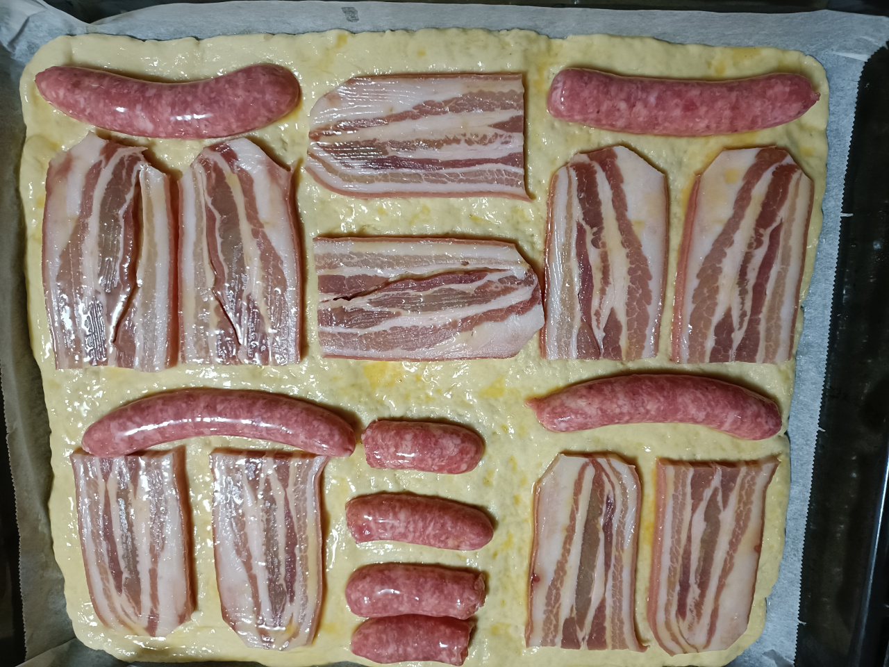

# Bollo de Requena

!!!ingredients "Ingredientes para 6 personas"

    * 1 vaso de leche de vaca entera o semidesnatada
    * 1 vaso de agua
    * 1 vaso de aceite de oliva virgen
    * 1 kg de harina
    * [Levadura fresca](../ingredientes/levadura-fresca.md)
    * 6 cortadas de panceta gruesas (0.5cm)
    * 6 longanizas
    * Sal

!!!utensils "Utensilios necesarios"

    * Bol grande
    * Pincel de cocina
    * Papel de horno
    * Bandeja de horno

## Elaboración

1. Mezclar el agua, la leche y el aceite en un bol grande, si el agua y la leche están tibias mejor.
1. Echar un poco de sal a la mezcla y deshacer media pastilla de levadura en la mezcla con la mano.
1. Echar harina y mezclar bien hasta que tengamos una masa que no se pegue en los dedos.
  
1. Dejamos la masa reposar sobre hora y media o hasta que su volumen sea el doble (el tiempo dependerá de la temperatura ambiente).
  
1. Sacar la masa y amasarla de nuevo durante unos 10 minutos.
1. Colocar papel de horno en la bandeja del horno y espolvorear un poco de harina.
1. Extender la masa sobre el papel de horno dejando un dedo de grosor.
  
1. Partir las cortadas de panceta por la mitad, si tienen un borde de color naranja es recomendable quitarlo ya que lleva hilos.
1. Poner las cortadas de panceta y las longanizas sobre la masa extendida y dejar reposar de nuevo un rato hasta que la masa crezca de nuevo un poco.
  
1. Precalentar el horno a 180 grados.
1. Batir un huevo y con un pincel de cocina untar la masa con el huevo batido.
  
1. Meter bollo al horno, calentar por arriba y por abajo, vigilar hasta que la masa esté cocida completamente.
