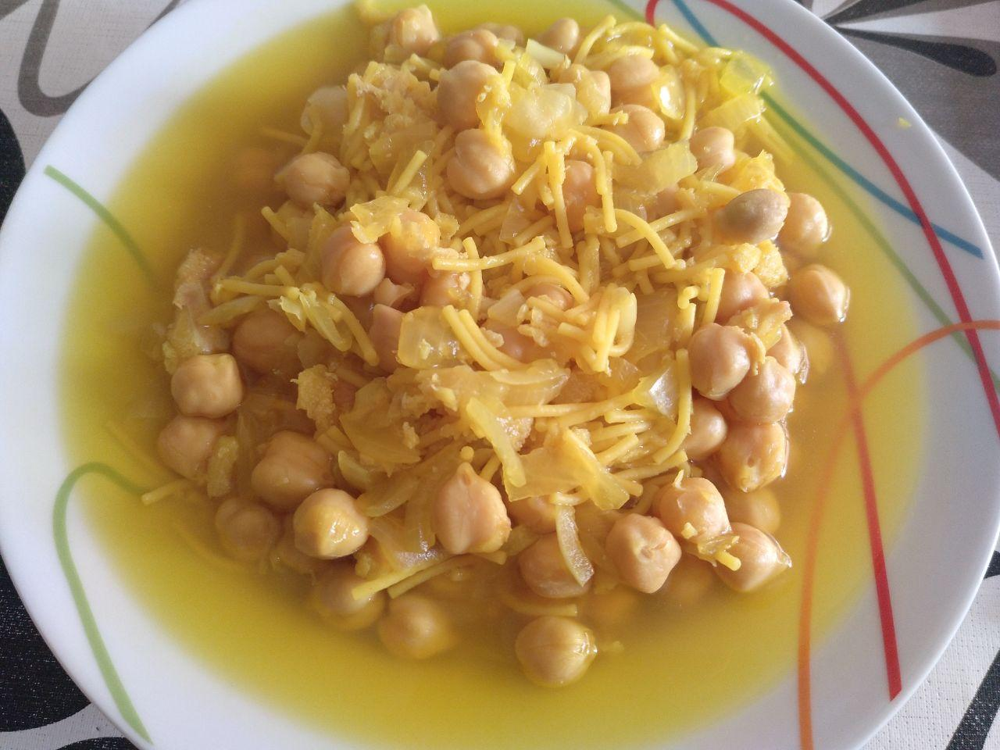

# Garbanzos con bacalao

!!!ingredients "Ingredientes para una persona"

    * [Bote de garbanzos cocidos](../ingredientes/garbanzos-cocidos.md) pequeño
    * Trozo de [bacalao congelado](../ingredientes/bacalao-congelado.md)
    * Media cebolla
    * [Fideos](../ingredientes/fideos.md) (opcional)

!!!utensils "Utensilios necesarios"

    * Cazuela
    * Sartén
    * Escurridor

## Elaboración

1. Ponemos agua a hervir en una cazuela aproximadamente 1/2 litro.
1. Partimos media cebolla, la pelamos y cortamos en trozos.
1. Sofreimos la cebolla en una sartén.
1. Sofreímos el bacalao congelado en la misma sartén y lo vamos troceando mientas se cuece.
1. Sacamos los garbanzos del bote, los escurrimos y aclaramos con un colador.
1. Cuando el agua hierva, echamos los garbanzos, el bacalao y la cebolla a la cazuela. Opcionalmente podemos echar un puñado de fideos.
1. Dejamos que hierva durante 20 minutos.
