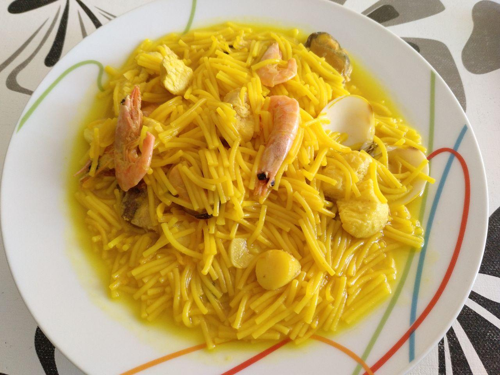

# Sopa de fideos con marisco

!!!ingredients "Ingredientes para una persona"

    * [Preparado para paella y sopa](../ingredientes/preparado-paella-sopa.md)
    * [Colorante alimentario](../ingredientes/colorante-alimentario.md)
    * [Fideos](../ingredientes/fideos.md)
    * Diente de ajo
    * Sal

!!!utensils "Utensilios necesarios"

    * Cazuela
    * Sartén

## Elaboración

1. Ponemos agua a hervir en una cazuela aproximadamente 1/2 litro.
1. Echamos aproximadmente un tercio de la bolsa de preparado de paella en un plato hondo, para una ración suele ser hasta cubrir el fondo.
1. Lavamos los trozos de marisco con agua.
1. Partimos un diente de ajo en trozos pequeños.
1. Sofreímos los trozos de marisco con el ajo en una sartén.
1. Cuando el agua hierva, echamos el sofrito a la cazuela.
1. Echamos sobre medio vaso de fideos a la cazuela.
1. Echamos colorante alimentario, un poco de sal y dejamos hervir unos 15 o 20 minutos hasta que los fideos estén cocidos.
