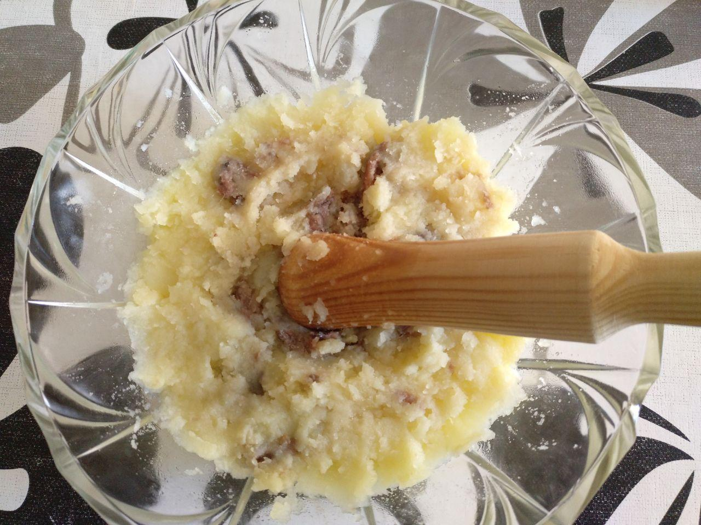

# Ajo arriero

## Ingredientes para una persona

* [Lata de anchoas](ingredients/anchoas.md) o [lata de atún](ingredients/lata-atun.md)
* 3 o 4 patatas medianas
* 1 o 2 dientes de ajo
* Un huevo

## Utensilios necesarios

* Cazuela
* Colador
* Mortero y maza
* Bol grande

## Elaboración

1. Ponemos agua a hervir en una cazuela, aproximadamante 3/4 litro.
1. Pelamos las patatas y las troceamos para que se cuezan más rápido. 
1. Cuando el agua hierva echamos las patatas en la cazuela.
1. En un mortero picamos uno o dos dientes de ajo, podemos echarle un poco de aceite a la mezcla si queremos.
1. Cuando las patatas estén hervidas las sacamos de la cazuela y las escurrimos.
1. Echamos las patatas y el ajo picado en un bol grande, echamos un huevo crudo y un poco de aceite. Picamos las patatas y lo mezclamos todo bien.
1. Una vez mezclado echamos la lata de atún o las anchoas troceadas al bol, y removemos un poco para que se mezcle.