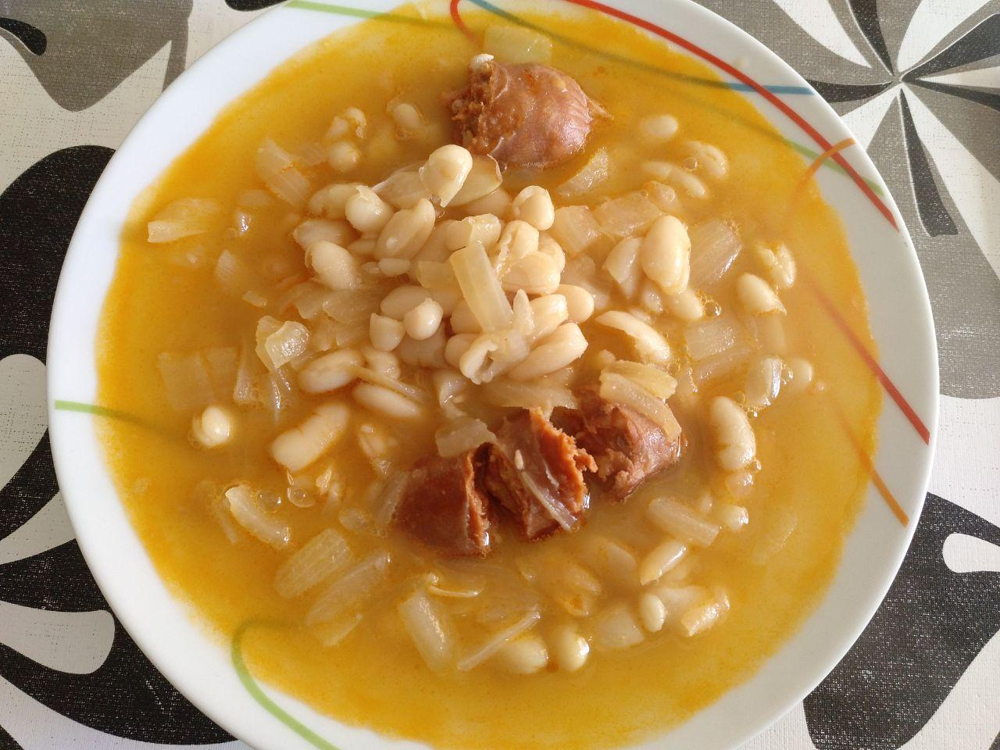

# Alubias con chorizo

## Ingredientes para una persona

* [Bote de alubias blancas cocidas](ingredients/bote-alubias-blancas-cocidas.md) pequeño
* [Caldo de carne](ingredients/caldo-carne.md)
* Media cebolla
* Un chorizo

## Utensilios necesarios

* Cazuela
* Sartén

## Elaboración

1. Sofreimos el chorizo en una sartén.
1. Cortamos media cebolla, la troceamos y ponemos a sofreir.
1. Ponemos el caldo de carne a hervir en una cazuela, aproximadamante 1/2 litro.
1. Cuando el caldo hierva, echamos el chorizo, la cebolla y medio bote de alubias a la cazuela.
1. Lo dejaos hervir a fuego lento durante 20 minutos.