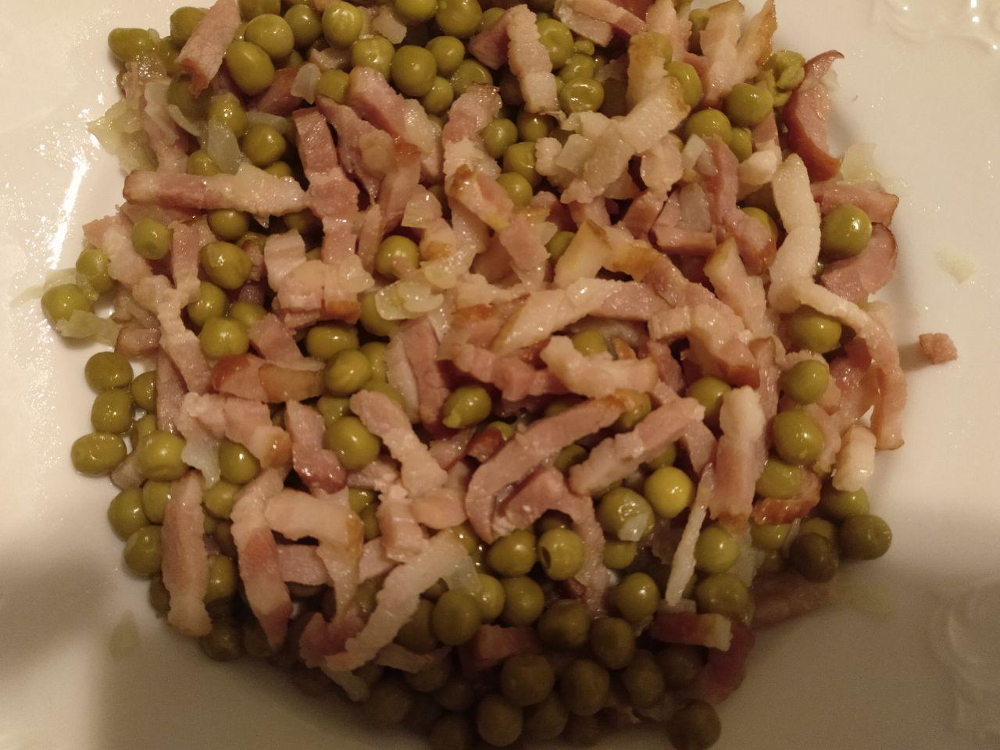

# Guisantes con bacon

## Ingredientes para una persona

* Un bote de guisantes
* Bacon o jamón

## Utensilios necesarios

* Sartén

## Elaboración

1. Cortamos el bacon en trozos pequeños, también podemos usar jamón.
1. Sofreimos el bacon en una sartén.
1. Cuando el bacon esté hecho se echan los guisantes a la sartén.
1. Removemos y mezclamos un poco durante uno o dos minutos. 