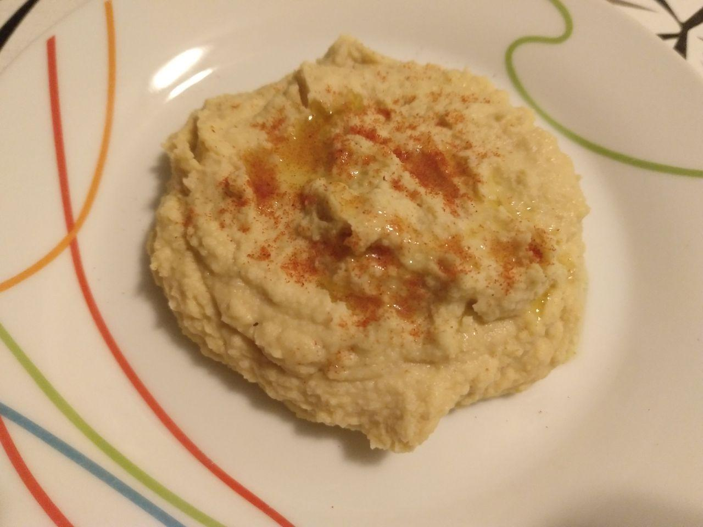

# Hummus

## Ingredientes para una persona

* Garbanzos cocidos (bote 210g)
* Medio limón
* Diente de ajo
* Pimentón dulce en polvo
* Comino en polvo
* Aceite de oliva

## Utensilios necesarios

* Batidora
* Vaso para batidora
* Exprimidor
* Colador

## Elaboración

1. Abrimos el bote de garbanzos, los echamos en un colador para lavarlos y escurrirlos.
1. Exprimimos medio limón.
1. Pelamos un diente de ajo, podemos trocearlo un poco para que se triture mejor.
1. Echamos el ajo y los garbanzos en el vaso de la batidora.
1. Echamos media cucharada pequeña de comino en polvo y otra media de pimentón dulce.
1. Echamos un poco de aceite y el zumo de limón exprimido.
1. Trituramos los ingredientes con la batidora, podemos echar más aceite o unas gotas de agua si vemos que sale muy espeso.
1. Para servir podemos poner unas cucharadas en un plato con un chorro de aceite y un poco de pimentón dulce.
