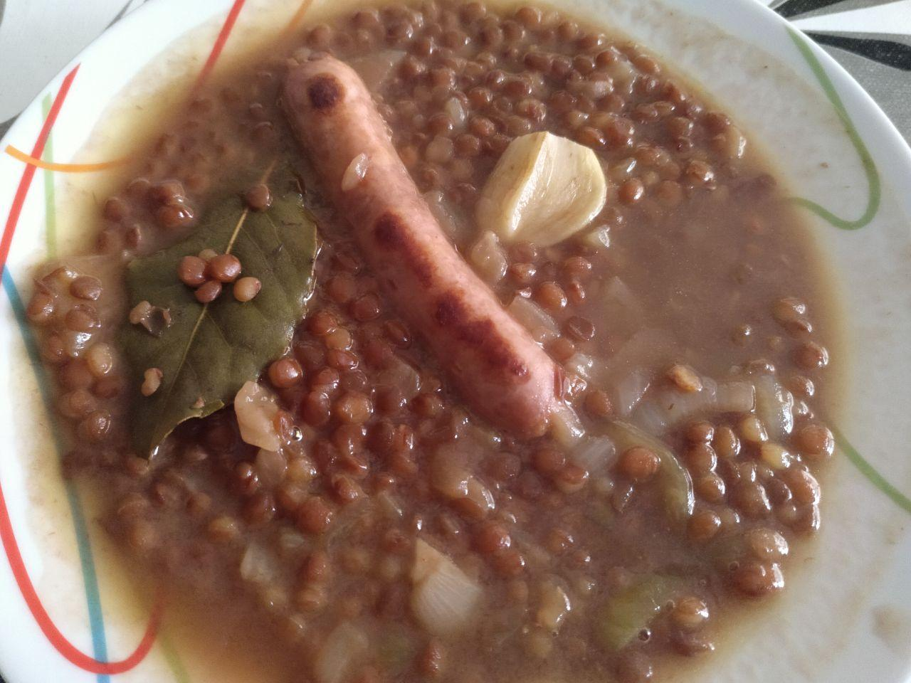

# Lentejas

## Ingredientes para una persona

* Medio bote de lentejas
* Media cebolla
* Un chorizo o longaniza
* Caldo de carne
* Una hoja de laurel
* Un diente de ajo

## Elaboración

1. Sofreimos el chorizo o longaniza en una sartén.
1. Cortamos media cebolla, la troceamos y ponemos a sofreir.
1. Ponemos el caldo de carne a hervir en una cazuela, aproximadamante 1/2 litro.
1. Cuando el caldo hierva, echamos el chorizo, la cebolla y medio bote de lentejas a la cazuela.
1. Añadimos el diente de ajo y la hoja de laurel.
1. Lo dejamos hervir a fuego lento durante 20 minutos.