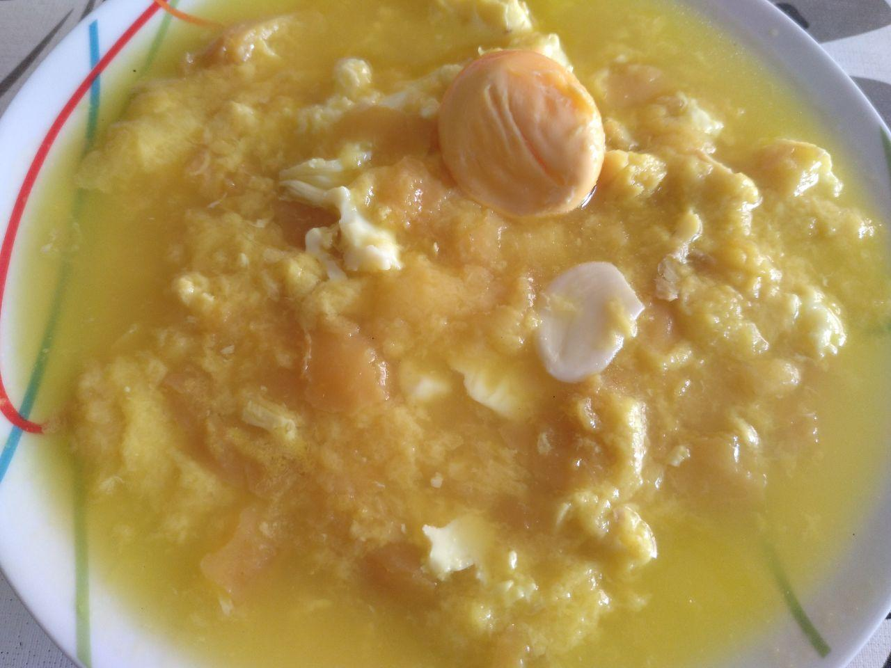

# Sopa de ajo

## Ingredientes para una persona

* Trozo de merluza congelada
* Pan duro
* 2 o tres dientes de ajo
* Un huevo
* Sal
* Colorante alimentario

## Elaboración

1. Ponemos agua a hervir, aproximadamante 1/2 litro.
1. Calentamos un poco el trozo de merluza en la sartén.
1. Cuando el agua hierva bajamos el fuego y echamos el pan duro, la merluza y los dientes de ajo.
1. Añadimos un poco de sal y el colorante alimentario.
1. Dejamos hervir a fuego medio durante unos 20 minutos.
1. 5 minutos antes de terminar, rompemos el huevo y lo echamos en la cazuela.
